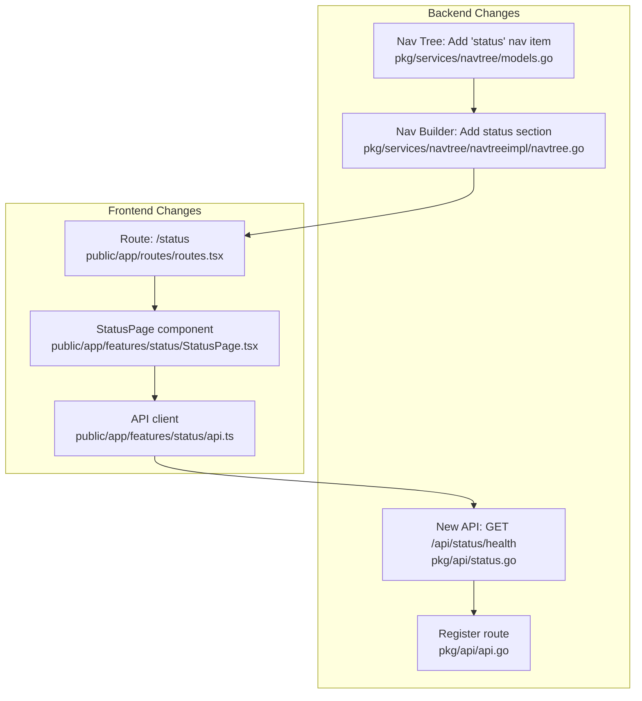

# Status Tab Implementation Plan

## Overview

Add a "Status" section to Grafana's left sidebar (positioned near the bottom, before Administration) that shows a unified health overview of the Grafana instance, configured data sources, and installed plugins.

## Architecture



## Backend Changes

### 1. Add nav weight and ID constants

In [`pkg/services/navtree/models.go`](pkg/services/navtree/models.go), add:
- A new `WeightStatus` constant between `WeightApps` and `WeightConfig` (so it sorts just before Administration)
- A new `NavIDStatus = "status"` constant

### 2. Add "Status" section to the nav tree

In [`pkg/services/navtree/navtreeimpl/navtree.go`](pkg/services/navtree/navtreeimpl/navtree.go) `GetNavTree()`, add a new section before the admin node:

```go
treeRoot.AddSection(&navtree.NavLink{
    Text:       "Status",
    Id:         navtree.NavIDStatus,
    SubTitle:   "Health and status of your Grafana instance",
    Icon:       "heart",
    SortWeight: navtree.WeightStatus,
    Url:        s.cfg.AppSubURL + "/status",
})
```

Gate it behind `c.IsSignedIn` and admin role check since health info is sensitive.

### 3. New backend API endpoint: `GET /api/status/health`

Create [`pkg/api/status.go`](pkg/api/status.go) with a handler that aggregates health from multiple sources:

- **Server health**: Reuse `databaseHealthy()` (already in `pkg/api/health.go`) and `config.BuildVersion`
- **Data sources**: Query all data sources for the org via `datasources.DataSourceService`, then call `pluginClient.CheckHealth()` for each backend data source
- **Plugins**: List installed backend plugins via `pluginStore`, call `pluginClient.CheckHealth()` for each

Response shape:

```json
{
  "server": {
    "version": "11.x.x",
    "database": "ok" | "failing"
  },
  "datasources": [
    {
      "uid": "...",
      "name": "Prometheus",
      "type": "prometheus",
      "status": "ok" | "error",
      "message": "..."
    }
  ],
  "plugins": [
    {
      "id": "...",
      "name": "...",
      "status": "ok" | "error",
      "message": "..."
    }
  ]
}
```

Data source health checks should run in parallel with a timeout to avoid blocking if a source is unresponsive.

### 4. Register the API route and frontend route

- In [`pkg/api/api.go`](pkg/api/api.go): Register `GET /api/status/health` under the authenticated API group with admin role requirement
- Add `r.Get("/status", reqSignedIn, hs.Index)` for the SPA route so the frontend page loads

## Frontend Changes

### 5. Create the Status page component

Create a new feature directory `public/app/features/status/` with:

- **`StatusPage.tsx`** -- Main page component using `useStyles2`, `Page` chrome wrapper, and cards showing:
  - **Server Health card**: Database status (green/red indicator), Grafana version
  - **Data Sources card**: Table/list of all data sources with name, type, and health status (color-coded badges)
  - **Plugins card**: Table/list of backend plugins with health status
  - A "Refresh" button to re-check all health statuses
- **`api.ts`** -- API client function: `getStatusHealth()` calling `GET /api/status/health` via `getBackendSrv()`

Follow the existing pattern in [`public/app/features/admin/ServerStats.tsx`](public/app/features/admin/ServerStats.tsx) for layout and styling conventions.

### 6. Register the frontend route

In [`public/app/routes/routes.tsx`](public/app/routes/routes.tsx), add:

```typescript
{
  path: '/status',
  component: SafeDynamicImport(
    () => import(/* webpackChunkName: "StatusPage" */ '../features/status/StatusPage')
  ),
},
```

## Key Design Decisions

- **Gated to admins**: Health information (DB status, plugin internals) is sensitive; restrict to org admins
- **Parallel health checks with timeout**: Data source health checks run concurrently with a per-check timeout (e.g. 5s) to prevent a single unresponsive source from blocking the entire page
- **Icon**: `heart` (available in Grafana's icon set) -- fits the "health" concept
- **No polling**: Health checks run on page load and on manual refresh, not via automatic polling (to avoid unnecessary load)
